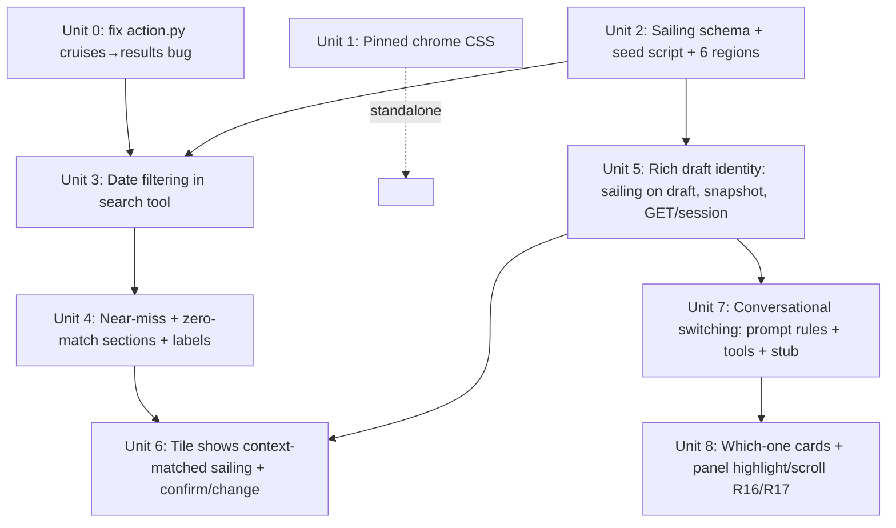
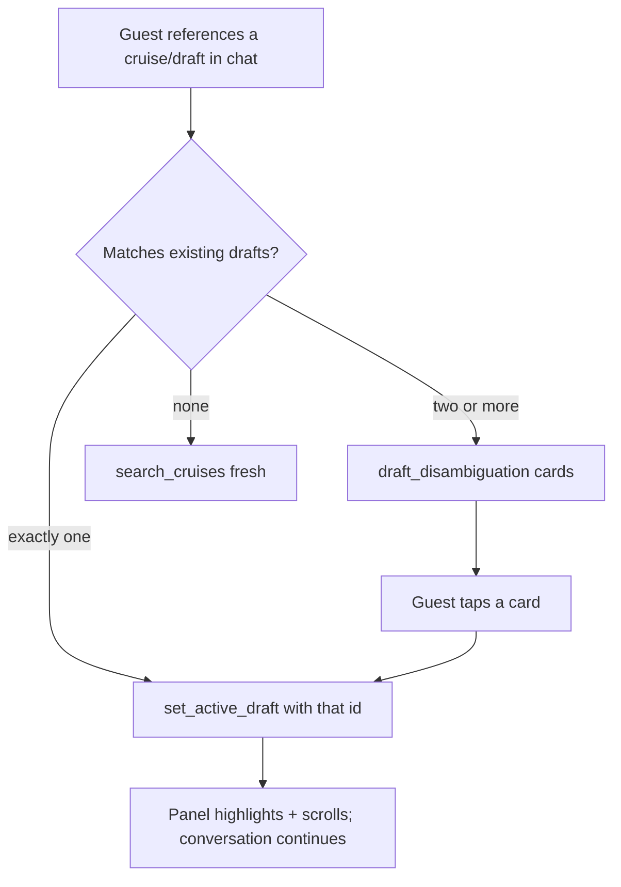

# feat: Pinned Chat Chrome, Date-Aware Catalog, Conversational Draft Switching

## Overview

Three coupled improvements to the Compass cruise concierge (Next.js 14 + FastAPI + Gemini `gemini-flash-latest`):

1. **Pinned chat chrome** — the drafts rail and message composer stay fully visible regardless of chat scroll (pure CSS; standalone).
2. **Date-aware catalog + date filtering + near-miss alternatives** — every cruise gets a seeded sailing series (concrete departure/return dates); a deterministic date filter in the search tool answers "all October sailings" / "14-day returning before Dec 28"; exact matches are shown first and never replaced, with clearly-labeled near-miss alternatives beneath, and a no-dead-end zero-match path.
3. **Rich draft identity + conversational draft switching** — each draft is anchored to a specific cruise *and* sailing (departure + return), the per-turn session snapshot carries rich identity plus the draft-held total, and the model switches the active draft when the guest references a draft in conversation (single reference → switch; 2+ candidates → which-one cards; no match → fresh search).

This plan also fixes a documented pre-existing bug where `/action`-path searches render empty because the mapper reads the wrong result key.

## Problem Frame

Guests hit four friction walls (see origin doc): drafts/composer scroll away on long chats; the catalog has no dates so the most common real constraint ("October", "back before Dec 28") is unanswerable; no-exact-match queries dead-end instead of offering labeled alternatives; and referencing an earlier draft triggers a comparison table or confusion instead of a context switch. Guests hold multiple drafts of the *same* region/cruise at different dates, so drafts need richer identity than a region name. (See origin: `docs/brainstorms/2026-07-21-pinned-ui-dates-draft-context-requirements.md`.)

## Requirements Trace

- R1. DraftRail stays fully visible; internal card-list scroll; fixed header/footer.
- R2. Composer anchored to viewport bottom at all scroll positions.
- R3. Every cruise carries a sailing series (departure + computed return per sailing); one catalog entry per cruise.
- R4. Catalog expands 4→6 regions (+ Hawaii 10–15 nights, + Bermuda/Bahamas 5–7 nights); ~30–40 cruises, each with a multi-month series.
- R5. Sailing series generated by a repeatable seed script.
- R6. Result tiles show one context-matched sailing (departure + return); extend existing tile.
- R7. Natural-language date filtering: month, return-by, duration, and combinations; results reflect real dates including returns.
- R8. Exact matches always shown first, never replaced by alternatives.
- R9. Below exact matches, clearly-labeled near-miss alternatives outside the stated constraint; labels supplied by tooling, rendered verbatim.
- R10. Zero exact matches → state "no exact matches" + closest relaxed alternatives (never empty).
- R11. Near-miss/relaxation logic is deterministic (in the tool); model presents tool output including labels verbatim; date/duration intents must invoke the tool via an explicit system-prompt rule (COMPARE-DRAFTS pattern) — prose-only filter answers forbidden.
- R12. Each draft anchored to a specific cruise **and** sailing (departure + return); sailing fixed at cruise selection (confirm-or-change the tile's context-matched sailing); changeable later.
- R13. Draft snapshot per draft: cruise name, region, embark port, departure date, return date, nights, draft-held total.
- R14. Catalog = base-price source of truth; draft holds evolving total; quote draft-held total for drafts, catalog base for cruises without a draft; never invent a draft-held total; panel tile shows draft-held total.
- R15. Conversational draft reference → switch active draft + continue (no comparison table for single-draft references); switch only on intent to discuss/modify, not incidental mentions.
- R16. Panel reflects every switch: newly-active draft highlighted and scrolled into view (conversational or click).
- R17. Reference matching 2+ drafts → ask "which one?" with tappable candidate cards (name, dates, nights, draft-held price); tapping performs the switch.
- R18. Reference with no matching draft → fresh catalog search (no error, no ghost draft).
- R19. Clicking a draft still switches (existing behavior preserved); conversational switching is additive.
- **Bug fix.** `backend/app/routes/action.py` `_build_components` reads `result.get("cruises")` but `search_cruises` returns `results` → `/action`-path searches render empty.

## Scope Boundaries

- No persistent storage — in-memory sessions + sessionStorage mirror stay as-is. Pre-existing sessionStorage drafts from before the schema change are demo-acceptable to clear (handled by the "Start New Chat" button which calls `sessionStorage.clear()`).
- No real inventory/availability; no checkout re-validation. `fare_now` does not fluctuate; only draft-held totals diverge via add-ons.
- No new voice transport work — Realtime → `/action` relay carries tool calls unchanged. Tool-definition changes propagate to voice automatically (voice tools are built from `TOOL_REGISTRY` in `backend/app/routes/voice.py`); system-prompt changes apply to the text path and are mirrored in the voice `instructions` string only where R15/R17 wording is essential.
- No itinerary/ports expansion.
- Comparison tables remain available for explicit comparison intents only (existing COMPARE DRAFTS behavior unchanged).
- New regions get identifiers `hawaii` and `bermuda_bahamas`. The search tool's Gemini/JSON schema does **not** enum-constrain `region` (it is a free `string` with a description) — extend the description text so the model knows the new values; no enum migration needed.

## Context & Research

### Relevant Code and Patterns

- **Models:** `backend/app/models.py` — `Cruise`, `Constraints` (no date fields today), `Draft` (`draft_id`, `cruise_id`, `label`, `fare_package`, `stateroom`, `dining`, `land_days`, `completed_steps`, `total`, `total_per_person`), `Session`.
- **Catalog loader:** `backend/app/catalog/loader.py` — validates `cruises.json` against `Cruise` at boot; caches in module-global `_catalog`. **Server restart required after reseeding.** Adding required fields to `Cruise` means every catalog record must carry them or boot fails — the seed script must write them.
- **Catalog data:** `backend/app/catalog/data/cruises.json` — currently 24 cruises (alaska 8, mexico 6, caribbean 6, mediterranean 4), nights 4–14, **no dates**.
- **Search tool:** `backend/app/tools/search.py` — merges args into `session.constraints`, filters, ranks by `popularity_score`, returns `{results, filters, total_matches}` (key is `results`).
- **Tool registry + schemas:** `backend/app/tools/__init__.py` — `TOOL_REGISTRY[name] = (handler, json_schema)`. `search_cruises` params: `region, nights_min, nights_max, embark_port, budget_max` (all optional).
- **Gemini loop:** `backend/app/llm/gemini_client.py` — agentic loop; `_map_tool_result_to_component` (every tool needs a branch or the UI gets nothing); `_build_session_snapshot` (per-turn draft snapshot, one terse line per draft); `_parse_chips` + 200-char tail buffer.
- **System prompt:** `backend/app/llm/system_prompt.py` — `SYSTEM_PROMPT` with `COMPARE DRAFTS RULE` (the template for "this intent MUST call a tool").
- **Stub orchestrator:** `backend/app/llm/stub_orchestrator.py` — deterministic keyword router used when `LLM_MODE=stub` (development default). Has a search branch that already parses `14-day`, `7-day`, region words. Must be extended to cover date filtering + switching so stub-mode browser testing works.
- **Action bridge:** `backend/app/routes/action.py` — `POST /action/{tool}`; `_build_components` mirrors the Gemini mapper (**has the `cruises` bug**); appends `system_event`; `_append_*` chain builders. Voice tool calls relay through here.
- **Session route:** `backend/app/routes/session.py` — `GET /session/{id}` returns sanitized drafts (`draft_id, cruise_id, label, completed_steps, total_formatted, fare_package, deposit_formatted, balance_formatted`). DraftRail hydrates from this. Extend with sailing fields + region/dates for R13/R16.
- **Money:** `backend/app/money.py` — `format_money`, `draft_total(draft, catalog, party)`. Draft-held total already computed and stored on `draft.total`; `GET /session` already returns `total_formatted`. R13/R14 mostly need to *surface* existing totals in the snapshot + tile, plus an add-on divergence note.
- **Draft creation:** `backend/app/tools/draft.py` — `create_draft` builds a draft with `completed_steps=[1]`, computes `total`. Must accept + store a chosen sailing (R12).
- **Frontend layout:** `frontend/app/page.tsx` (~591–653) — `<main>` (`flex-1 flex flex-col min-h-0`) with scroll area `flex-1 overflow-y-auto`, then `SuggestionChips`, then `Composer`; `DraftRail` is a flex sibling `<aside>`. Refresh logic: `refreshDrafts()` re-fetches `GET /session` after every chat turn and every action.
- **DraftRail:** `frontend/components/drafts/DraftRail.tsx` — 240px aside, `display:flex flex-column`, **no `overflow-y-auto` on card list**; `DraftInfo` type carries only `draft_id, label, completed_steps, total_formatted`.
- **Composer:** `frontend/components/chat/Composer.tsx` — wrapped in `.px-4 pb-4 pt-2`; relies on flex position, no `flex-none`/sticky guarantee.
- **CardRow / tile:** `frontend/components/cards/CardRow.tsx` — `CruiseCard` renders `nights, embark_port, fare_was, fare_now, badge`; `CardData` has an index signature (`[key: string]: unknown`) so new fields pass through. Empty state exists (`EmptyState` with widen chips).
- **Component registry:** `frontend/lib/componentRegistry.tsx` — `REGISTRY` maps `descriptor.type` → component; unknown types render a debug pill. New descriptor types must be registered.
- **API client:** `frontend/lib/api.ts` — `postChat` (SSE), `postAction`, `getStepOptions`.

### Institutional Learnings

From `docs/solutions/integration-issues/gemini-function-calling-chat-ui-integration-2026-07-21.md` (mandatory patterns):

1. **Every tool the model can call needs a `_map_tool_result_to_component` branch** — an unmapped tool runs but the UI gets `components: []`. Any new descriptor shape (two-section results, which-one card) must have a mapper branch *and* a mirrored `_build_components` branch in `action.py`.
2. **Explicit system-prompt rules or Gemini freeloads in prose.** Date-filter and draft-switch intents must have COMPARE-DRAFTS-style "you MUST call the tool" rules, plus an explicit incidental-mention guard for switching.
3. **Session snapshot must list exact ids** and is the model's id reference; extending it (R13) is the correct mechanism.
4. **`set_active_draft` mapping needs two-key fallback** (`active_draft_id` or `draft_id`) — already present; preserve it.
5. **Stub/live parity via `FakeClient` + `patch_genai_types`.** Live-path tests inject a fake client (`gemini_client.set_client(...)`) and patch `google.genai.types` so `from google.genai import types` resolves to the fake (set `fake_genai.types = FakeTypes` — the attribute assignment is what the current import form exercises). Pattern is established in `backend/tests/test_p12_fixes.py` and `test_action_parity.py`.
6. **Model ids rot** — keep `gemini-flash-latest` (already in place); do not pin.
7. **Cost discipline** — develop with `LLM_MODE=stub` (free deterministic turns); reserve live Gemini for final verification. The per-draft snapshot (R13) grows each paid turn — keep it terse (see Unit 6 sizing note).

### External References

None required — all patterns exist locally (search tool, snapshot, forced-tool rule, component mapper, stub parity). This is well-patterned work extending an established architecture.

## Key Technical Decisions

- **Sailing series as a list on `Cruise` (`sailings: list[Sailing]`), not one entry per date.** Preserves cruise identity, supports same-cruise/different-date drafts, keeps the catalog compact. Each `Sailing` = `{sailing_id, departure_date (YYYY-MM-DD), return_date (YYYY-MM-DD)}`. Return is computed by the seed script (`departure + nights`) and stored (denormalized) so filters don't recompute. (User-selected, origin Key Decisions.)
- **Date filtering extends the existing `search_cruises` tool, not a new tool.** Keeps one search entry point and one component-mapping branch. New optional args: `month` (int 1–12; month names are normalized to int in the stub/parse layer — Gemini emits int per the schema description), `return_by` (YYYY-MM-DD or "Dec 28" style), plus reuse of `nights_min/nights_max` for duration. The tool iterates sailings, picks the context-matched sailing per cruise, and computes near-miss sections deterministically.
- **Two-section result descriptor is an *extended* `card_row`, not a new component type.** Add an optional `sections` field: `sections: [{label: str|null, cards: [...]}, ...]`. When `sections` is present the CardRow renders labeled groups with a visual separator; when absent it renders the flat `cards` list exactly as today (back-compat). Labels come from the tool, rendered verbatim (R9/R11). This avoids a new registry entry for results and keeps the empty-state path intact.
- **Which-one disambiguation is a new descriptor type `draft_disambiguation` + new component + registry entry.** Its cards carry `draft_id` (not `cruise_id`); tapping calls `set_active_draft` via `postAction`. This is genuinely new UI, so a new type is warranted (unlike the results case).
- **Rich identity + draft-held total flow through the existing snapshot and `GET /session`,** not a new endpoint. R13 fields are added to `_build_session_snapshot` (one extended line per draft) and to the `GET /session` draft dict; the tile shows the draft-held total (already returned) plus an add-on divergence note.
- **Sailing chosen at cruise selection; draft always born with a date.** `create_draft` accepts an optional `sailing_id`; if omitted it defaults to the tile's context-matched sailing (next upcoming, or the constraint-satisfying one). Confirm-or-change is an inline control on the result tile (a compact sailing line + "change date" affordance) — no new funnel step. Later change is a new `set_sailing` tool. (User-selected.)
- **Deterministic relaxation ladder in the tool** (see Unit 4 reference). Model never decides relaxation. (Origin Key Decision.)
- **Year inference for relative dates:** the seed script anchors sailings to a fixed demo "now" (`2026-07-01`, matching the current project date). Relative month/return-by filters with no year resolve to the *next* occurrence on/after that anchor. The anchor is a module constant so tests are deterministic.
- **Stub orchestrator must mirror the new routing** (date filter, switch, disambiguate) so `LLM_MODE=stub` browser verification exercises the same UI paths. Stub is keyword-based; it detects month names / "before <date>" / draft references and calls the same tools.

## Open Questions

### Resolved During Planning

- *Extend search tool vs new date tool?* → Extend `search_cruises` (one entry point, one mapper branch).
- *New component for two-section results?* → Extended `card_row` with optional `sections`; new type only for which-one cards.
- *Region enum migration?* → Not needed; `region` is a free string in the schema. Extend the description text only.
- *Where does draft-held total come from?* → Already computed (`draft.total`, `GET /session.total_formatted`); surface it in snapshot + tile; add divergence note = `total − base×party`.
- *Migration of pre-change sessionStorage drafts?* → Demo-acceptable to clear; "Start New Chat" already clears. New required `Cruise.sailings` only affects catalog boot (seed writes them), not in-flight drafts. `Draft` gains an **optional** `sailing_id`/date fields so old in-memory drafts still validate.
- *Year inference?* → Fixed demo anchor `2026-07-01`; relative dates resolve to next occurrence on/after anchor.

### Deferred to Implementation

- Exact relaxation ladder thresholds may be tuned against seeded data during Unit 4 (start from the reference ladder; adjust if a common query returns an empty near-miss section).
- Exact highlight treatment (transient pulse vs persistent ring) for R16 — start with a persistent gold ring on the active card (matches existing active-card border) + `scrollIntoView`; refine visually in Unit 8.
- Precise seed cadence per region (weekly vs biweekly) tuned so each cruise has 8–16 sailings over ~6 months without bloating snapshot/token cost.

## High-Level Technical Design

> *This illustrates the intended approach and is directional guidance for review, not implementation specification. The implementing agent should treat it as context, not code to reproduce.*

Dependency graph (respects the origin dependency chain: pinned chrome standalone; date schema → filter → near-miss; date schema + rich identity → switching):



Draft reference resolution (R15/R17/R18), implemented deterministically in the tool the model is forced to call:



## Implementation Units

- [ ] **Unit 0: Fix `/action` search result-key bug**

**Goal:** `/action/search_cruises` renders cards instead of an empty row.

**Requirements:** Bug fix (origin Dependencies/Assumptions).

**Dependencies:** None (do first — Unit 3 tests exercise this path).

**Files:**
- Modify: `backend/app/routes/action.py` (`_build_components`, `search_cruises` branch)
- Test: `backend/tests/test_action_search_fix.py` (new)

**Approach:**
- In `_build_components`, change the `search_cruises` branch from `result.get("cruises", [])` to `result.get("results", [])` (mirror the already-correct `gemini_client._map_tool_result_to_component`).

**Patterns to follow:** `gemini_client._map_tool_result_to_component` `search_cruises` branch (already reads `results`).

**Test scenarios:**
- Happy path: `POST /action/search_cruises` with `{region: "alaska"}` → response `components` contains a `card_row` whose `cards` is non-empty and length ≤5.
- Integration: the same tool result dict passed through both `action._build_components` and `gemini_client._map_tool_result_to_component` yields the same non-empty `cards` (shared-factory parity, per learning #1 prevention).
- Edge: a region with zero matches still returns a `card_row` (possibly empty `cards`) not a crash.

**Verification:** A tile-tap / voice-relayed search shows cruise cards; parity test passes.

---

- [ ] **Unit 1: Pinned chat chrome (DraftRail + Composer)**

**Goal:** DraftRail and Composer stay fully visible/usable at any chat scroll position.

**Requirements:** R1, R2.

**Dependencies:** None (standalone; pure layout).

**Files:**
- Modify: `frontend/app/page.tsx` (body layout ~591–653)
- Modify: `frontend/components/drafts/DraftRail.tsx`
- Modify: `frontend/components/chat/Composer.tsx`
- Test expectation: browser-verifiable (no unit test — pure CSS/layout).

**Approach:**
- **DraftRail:** keep the aside `flex-none` (already `flexShrink:0`, add explicit `flex-none` semantics and a bounded height). Make the header ("Drafts") and footer ("held for 7 days…") fixed, and wrap the card list (`ActiveDraftCard` + `InactiveDraftChip`s) in a middle `div` with `flex:1 1 auto; min-height:0; overflow-y:auto`. The aside height must be bounded by the body row (`overflow-hidden` on the parent already caps it) so internal scroll engages when drafts overflow.
- **Composer:** ensure the composer wrapper is `flex-none` within `<main>` and the scroll area above it is the only growing/scrolling region. `<main>` is already `flex flex-col min-h-0` with the message area `flex-1 overflow-y-auto`; make `SuggestionChips` + `Composer` explicitly `flex-none` so they never get pushed out. Verify the composer sits at the viewport bottom because `<main>` fills the body row height.
- **Do not** break the P15 768px rail breakpoint. At ≤768px the rail collapses (existing behavior) — confirm the new bounded-height/overflow rules degrade gracefully (rail hidden or below; composer still pinned).

**Patterns to follow:** existing `<main>` `min-h-0` flex chain in `page.tsx`; existing `flexShrink:0` on the aside.

**Test scenarios:**
- Test expectation: none (no behavioral logic) — verified via browser assertions in the Unit 1 test set below.

**Verification:** With a long transcript scrolled to the top, both the Drafts panel (all cards reachable via the panel's own scroll) and the Composer input are visible and usable without scrolling the chat.

---

- [ ] **Unit 2: Sailing schema + 6-region catalog + seed script**

**Goal:** Every cruise carries a seeded sailing series with departure/return dates; catalog spans 6 regions and ~30–40 cruises.

**Requirements:** R3, R4, R5.

**Dependencies:** None (foundation for Units 3, 5, 6).

**Files:**
- Modify: `backend/app/models.py` (`Cruise`, add `Sailing`; `Constraints`; `Draft`)
- Create: `backend/app/catalog/seed_sailings.py` (repeatable seed script)
- Modify: `backend/app/catalog/data/cruises.json` (regenerated with `sailings` + new regions)
- Create/Modify catalog satellite data for new-region cruises: `backend/app/catalog/data/itineraries.json`, `dining.json`, `staterooms.json`, `land_options.json` (add minimal rows for new cruise_ids so `draft_total`, dining, and stateroom flows don't break)
- Test: `backend/tests/test_sailings_schema.py` (new)

**Approach:**
- Add `Sailing(BaseModel)`: `sailing_id: str`, `departure_date: str` (ISO `YYYY-MM-DD`), `return_date: str` (ISO). Add `sailings: list[Sailing] = Field(default_factory=list)` to `Cruise` (default empty keeps back-compat for any record temporarily missing them, but the seed writes them for all).
- Extend `Constraints` with optional date fields used by Unit 3: `month: Optional[int] = None`, `return_by: Optional[str] = None`. (Kept on `Constraints` so they compose like other filters.)
- Add to `Draft`: `sailing_id: Optional[str] = None`, `departure_date: Optional[str] = None`, `return_date: Optional[str] = None` (optional so pre-change in-memory drafts still validate; Unit 5 populates them at creation).
- **Seed script** (`seed_sailings.py`, runnable as `python -m app.catalog.seed_sailings`):
  - Module constant `DEMO_ANCHOR = date(2026, 7, 1)`.
  - For each cruise, generate a series: cadence by region (short Bermuda/Bahamas 5–7 nights → weekly; long Hawaii 10–15 nights → biweekly; others weekly/biweekly), spanning ~6 months from the anchor, 8–16 sailings per cruise.
  - `sailing_id = f"{cruise_id}-{departure_date}"`. `return_date = departure_date + nights` (using the cruise's `nights`).
  - Deterministic (no RNG, or seeded RNG with a fixed seed) so re-running produces identical JSON — R5.
  - Add new-region cruises: Hawaii (10–15 nights, e.g. 3–4 cruises) and Bermuda/Bahamas (5–7 nights, e.g. 3–4 cruises), `region` = `hawaii` / `bermuda_bahamas`, with realistic names, ships, ports, fares, `popularity_score`, `photo` (reuse an existing SVG path if no art). Bring total to ~30–40.
  - Writes `cruises.json` in place (pretty-printed, stable key order).
- Add minimal satellite rows (staterooms at least: the 4 standard categories per new cruise so `set_stateroom`/`draft_total` work; a couple of dining venues; itinerary days) for each new cruise_id so downstream flows validate and price.
- **Loader caches at boot** — document that a server restart is required after reseeding (already true; note in the seed script docstring).

**Technical design:** *(directional)*

```
Sailing = { sailing_id, departure_date: "YYYY-MM-DD", return_date: "YYYY-MM-DD" }
Cruise.sailings = [Sailing, ...]         # 8–16 entries, spanning ~6 months from DEMO_ANCHOR
seed: for cruise in catalog:
        d = first departure on/after DEMO_ANCHOR aligned to cadence
        while d < DEMO_ANCHOR + ~6 months:
          add Sailing(f"{id}-{d}", d, d + nights)
          d += cadence(region)
```

**Patterns to follow:** existing `Cruise` field style in `models.py`; existing JSON record shape in `cruises.json`; `loader._validate_list` boot validation.

**Test scenarios:**
- Happy path: `load_catalog()` succeeds; every cruise has `len(sailings) >= 8`; each sailing's `return_date == departure_date + nights` (parse + compare).
- Happy path: catalog contains exactly 6 distinct regions including `hawaii` and `bermuda_bahamas`; total cruises between 30 and 40.
- Edge: Hawaii cruises all have `nights` in 10–15; Bermuda/Bahamas all in 5–7.
- Determinism: running `seed_sailings` twice produces byte-identical `cruises.json` (or: importing and calling the generator twice yields equal sailing lists) — R5.
- Integration: `draft_total` and `create_draft` succeed for one new-region cruise_id (satellite data present).
- Schema: every sailing_id is unique across the catalog.

**Verification:** Backend boots; catalog validation passes; sailing/return math and region/nights invariants hold; seed is reproducible.

---

- [ ] **Unit 3: Date filtering in `search_cruises`**

**Goal:** Natural-language date filters (month, return-by, duration, combinations) return real dated results with the context-matched sailing per cruise.

**Requirements:** R7, R11 (tool invocation half), R6 (context-matched sailing selection).

**Dependencies:** Unit 0 (action mapper fix), Unit 2 (sailings exist).

**Files:**
- Modify: `backend/app/tools/search.py`
- Modify: `backend/app/tools/__init__.py` (extend `search_cruises` schema: add `month`, `return_by`; extend `region` description with new values)
- Modify: `backend/app/llm/system_prompt.py` (add DATE FILTER RULE)
- Modify: `backend/app/llm/stub_orchestrator.py` (parse month names + "return before/by <date>" → date args)
- Test: `backend/tests/test_search_dates.py` (new)

**Approach:**
- Extend `search_cruises` args/merge with `month` (int 1–12; accept month names in the stub/parse layer, normalize to int) and `return_by` (ISO date, or a "Mon DD" string normalized via a small parser with year inference against `DEMO_ANCHOR`).
- After region/nights/budget filtering, for each surviving cruise select the **context-matched sailing**:
  - If `month` set: the earliest sailing whose `departure_date` month == month (and year is the next occurrence ≥ anchor).
  - If `return_by` set: the latest sailing whose `return_date <= return_by` (so the guest gets the longest/most-optimal option that still returns in time); if none, the cruise has no exact sailing for this constraint (handled in Unit 4 near-miss).
  - If both: sailings satisfying both; pick earliest departure.
  - If neither date constraint: the **next upcoming departure** (`departure_date >= anchor`), earliest.
  - A cruise with no sailing satisfying the date constraints is excluded from *exact* results (Unit 4 relaxes).
- Each result card carries the selected sailing: add `departure_date`, `return_date`, `sailing_id` to the card dict (Unit 6 renders them).
- **System prompt DATE FILTER RULE** (mirror COMPARE DRAFTS RULE wording): date/month/duration/return-by filter intents MUST call `search_cruises` with the parsed constraints; prose-only answers to date queries are forbidden; present the tool's results and section labels verbatim.
- **Stub orchestrator:** in the search branch, detect month names (`january`…`december`, `oct` etc.) → `month`; detect "return(ing) before/by <date>" / "back before <date>" → `return_by` (normalize via the same parser). Keep existing nights parsing. **Also extend both keyword lists in `stub_orchestrator.py`:** (a) the search-trigger list (currently `("alaska","mexico","caribbean","mediterranean","cruise","sail","voyage")`) must also include `"hawaii"`, `"bermuda"`, and `"bahamas"`; (b) the region-parse list used to map keywords to `region` values must include the same three terms (mapping `"hawaii"` → `hawaii`; `"bermuda"` / `"bahamas"` → `bermuda_bahamas`). Without this, Unit 7's stub test "show me hawaii → `search_cruises` invoked" fails because the search branch never fires.

**Reference — schema additions (`search_cruises` params):**
```
"month":      {"type": "integer", "description": "Departure month 1-12 (e.g. 10 for October)"}
"return_by":  {"type": "string",  "description": "Latest acceptable return date, ISO YYYY-MM-DD"}
"region" description → "...: alaska|mexico|caribbean|mediterranean|hawaii|bermuda_bahamas"
```

**Reference — DATE FILTER RULE text (draft):**
> DATE FILTER RULE: When the guest constrains by date — a month ("October sailings"), a return-by date ("back before Dec 28"), a duration ("14-day"), or any combination — you MUST call `search_cruises` with the parsed constraints (region, nights_min/nights_max, month, return_by). Never answer a date/duration question in prose. Present the tool's results, including any section labels, exactly as returned.

**Patterns to follow:** existing `search_cruises` merge/filter/rank structure; `COMPARE DRAFTS RULE` prompt style; stub search-branch regex parsing.

**Test scenarios:**
- Happy path (month): `search_cruises(session, {region:"alaska", month:10})` → every returned card's `departure_date` is in October; `sailing_id`/`return_date` present.
- Happy path (duration+return-by): `{nights_min:14, nights_max:14, return_by:"2026-12-28"}` → every card is 14-night and its `return_date <= 2026-12-28`.
- Happy path (no date constraint): plain region search → each card's sailing is the next departure ≥ `DEMO_ANCHOR`.
- Edge (month/year inference): a month earlier than the anchor month resolves to the next year's occurrence (departure ≥ anchor).
- Edge (return-by too early): a `return_by` before any sailing returns → that cruise absent from exact results (no crash; sets up Unit 4).
- Edge (case-insensitive stub parse): stub receives "all October sailings" → calls `search_cruises` with `month=10`.
- Error: malformed `return_by` string → tool ignores it gracefully (no exception) or normalizes; assert no 500.
- Integration (mapper): result maps to a `card_row` component with dated cards through `_map_tool_result_to_component` (and `action._build_components`).

**Verification:** "all October Alaska sailings" and "14-day returning before Dec 28" return correctly dated, filtered cards; the model/stub calls the tool rather than answering in prose.

---

- [ ] **Unit 4: Deterministic near-miss + zero-match sections**

**Goal:** Exact matches first (never replaced); labeled near-miss alternatives beneath; zero-match produces closest relaxed alternatives, never empty.

**Requirements:** R8, R9, R10, R11 (deterministic-in-tool half).

**Dependencies:** Unit 3.

**Files:**
- Modify: `backend/app/tools/search.py` (build `sections` output)
- Modify: `backend/app/llm/gemini_client.py` (`_map_tool_result_to_component` — pass `sections` through on `card_row`)
- Modify: `backend/app/routes/action.py` (`_build_components` — mirror `sections`)
- Modify: `frontend/components/cards/CardRow.tsx` (render optional labeled `sections`)
- Modify: `backend/app/llm/stub_orchestrator.py` (search branch emits `sections` from the tool result)
- Test: `backend/tests/test_search_nearmiss.py` (new)
- Test (frontend): browser-verifiable section rendering (asserted in Unit 4 browser tests)

**Approach:**
- When a date/duration constraint is present, `search_cruises` returns a `sections` list in addition to (or instead of) flat `results`:
  - `sections[0]` = exact matches, `label: null` (or `"Exact matches"`), cards = constraint-satisfying context-matched sailings, ranked by popularity. **Never mixed with alternatives.**
  - `sections[1..]` = near-miss groups with explicit labels, produced by the **relaxation ladder** (below). Only included when they contain cards.
  - `total_matches` still reflects exact count.
- **Zero exact matches:** `sections[0].cards == []`; add a top-level `no_exact: true` flag and populate near-miss sections with the closest relaxed alternatives across the ladder (including adjacent-region matches when duration/date still fit). The model states "no exact matches" (prompt already forbids prose-only; the tool supplies labels).
- **Relaxation ladder (deterministic; reference starting values, tune in-unit):**
  1. Duration ±: if `nights_min/nights_max` set, include cruises within ±3 nights of the band (e.g. a 7-night alongside "14-day"), label `"Shorter/longer options outside your {N}-night request"`.
  2. Date shift: if `month`/`return_by` set, include the same cruises' sailings within ±7 days of the constraint boundary, label `"Sailings within a week of your dates"`.
  3. Adjacent region (zero-match only): other regions whose sailings satisfy the date/duration, label `"Other regions matching your dates"`.
  - Labels are **strings in the tool output, rendered verbatim** — never generated by the model. Each near-miss card carries the same dated fields as exact cards.
- **CardRow rendering:** if `descriptor.sections` present, render each section: an optional label header (small uppercase kicker, with a hairline separator between sections) then the horizontal card scroller; if `sections` absent, render `descriptor.cards` exactly as today (back-compat, empty-state path intact).
- **Mappers:** both `_map_tool_result_to_component` and `action._build_components` must forward `sections` (and `no_exact`) onto the `card_row` descriptor when present.

**Reference — extended `card_row` descriptor:**
```
{ "type": "card_row",
  "filters": {...},
  "cards": [...],                 # back-compat: flat list (no date constraint)
  "sections": [                   # present when a date/duration constraint was applied
     {"label": null, "cards": [<exact>...]},
     {"label": "Shorter options outside your 14-night request", "cards": [...]},
     ...],
  "no_exact": false }
```

**Patterns to follow:** existing `card_row` shape and `CardRow` scroller; label-verbatim discipline from R11; `EmptyState` widen-chip pattern (still used when even relaxed alternatives are empty — should be rare with 6 regions).

**Test scenarios:**
- Happy path (exact first): a "14-day returning before Dec 28" query with ≥1 exact match → `sections[0].cards` all satisfy the constraint; `sections[0]` is first; near-miss sections (if any) come after and contain only non-satisfying cards.
- Happy path (labeled near-miss): a "14-day" query where 7-night options exist → a near-miss section with a label explicitly marking them as outside the 14-night request; exact 14-night section unpolluted.
- Zero-match (R10): a constraint no cruise satisfies exactly → `no_exact: true`, `sections[0].cards == []`, and at least one non-empty relaxed section (nearby duration/date or adjacent region).
- Determinism (R11): identical args produce identical section labels and ordering across two calls.
- Never-replace (R8): the count/content of `sections[0]` for a query with exact matches is unaffected by the presence of near-miss cards (assert exact set is exactly the constraint-satisfying set).
- Edge: labels are non-empty strings and come from the tool (assert exact label text, since it is rendered verbatim).
- Integration (mapper parity): `sections` survives both `_map_tool_result_to_component` and `action._build_components`.

**Verification:** "14-day returning before Dec 28" shows exact matches first, then a clearly-labeled shorter-options section; a deliberately impossible query shows a "no exact matches" section plus closest alternatives; exact section never polluted.

---

- [ ] **Unit 5: Rich draft identity — sailing on draft, snapshot, GET /session**

**Goal:** Drafts carry a specific sailing; the model's snapshot and the frontend both see rich identity + draft-held total.

**Requirements:** R12 (draft anchored to sailing), R13, R14.

**Dependencies:** Unit 2 (sailings + Draft date fields).

**Files:**
- Modify: `backend/app/tools/draft.py` (`create_draft` accepts/stores `sailing_id`; add `set_sailing` handler)
- Modify: `backend/app/tools/__init__.py` (add `set_sailing` tool + schema; extend `create_draft` schema with optional `sailing_id`)
- Modify: `backend/app/llm/gemini_client.py` (`_build_session_snapshot` — add region, ports, dates, nights, draft-held total per draft)
- Modify: `backend/app/routes/session.py` (`GET /session` draft dict — add `region`, `embark_port`, `departure_date`, `return_date`, `nights`, and an add-on divergence note)
- Modify: `frontend/components/drafts/DraftRail.tsx` (`DraftInfo` gains fields; tile shows dates + draft-held total + "includes $X add-ons" note)
- Modify: `frontend/app/page.tsx` (`fetchSession` maps new fields into `DraftInfo`)
- Test: `backend/tests/test_draft_identity.py` (new); `backend/tests/test_snapshot_rich.py` (new)

**Approach:**
- `create_draft(args)`: read optional `sailing_id`; resolve it against the cruise's `sailings`. If absent, default to the **context-matched sailing** — the next upcoming departure (or, if the session carried a date constraint, the sailing satisfying it). Store `sailing_id`, `departure_date`, `return_date` on the `Draft`. Every draft is thus born with a date (R12).
- `set_sailing(session, {draft_id, sailing_id})`: validate the sailing belongs to the draft's cruise; update the three draft fields; return updated draft info. Register in `TOOL_REGISTRY` + add `_build_components` handling (tracker/no-op component) + a `_map_tool_result_to_component` branch (learning #1). Add `_make_event_text` line in `action.py`.
- **Snapshot (`_build_session_snapshot`):** extend each draft line with `region`, `embark_port`, `departure`, `return`, `nights`, and `draft_total` (formatted). Keep it to **one line per draft** to control token cost — see sizing note. Pull cruise `region/embark_port/nights` from the catalog map already built in the function; pull dates from the draft; pull total from `draft.total`.
- **`GET /session` draft dict:** add `region`, `embark_port`, `departure_date`, `return_date`, `nights`, and `addons_note` (e.g. `"includes US$ 300 add-ons"` computed as `draft.total − base_fare×party`; omit/null when zero). `total_formatted` already present (draft-held total).
- **DraftRail tile:** show the sailing dates line (e.g. "Aug 3 – Aug 10 · 7 nights"), the draft-held `total_formatted`, and the add-on divergence note when present. R14: the panel tile shows the draft-held total (never the base).
- **R14 model behavior** is enforced by prompt text (Unit 7's snapshot + a short rule): quote draft-held total for drafts, catalog base for cruises without a draft, never invent a draft-held total.

**Reference — extended snapshot draft line (draft, terse):**
```
- id=<id> label='<label>' cruise='<name>' region=<r> port='<embark>' dep=<YYYY-MM-DD> ret=<YYYY-MM-DD> nights=<n> total=US$X,XXX fare=<pkg> steps=[...]
```

**Snapshot sizing note (cost cap):** the snapshot grows per paid Gemini turn. With a 3-draft cap and ~1 line/draft, the added fields are ~40–60 tokens/draft (~180 tokens worst case). This is within existing per-turn caps (see memory note `compass-live-gemini-setup`). Do **not** add itinerary or per-sailing lists to the snapshot.

**Patterns to follow:** existing `_build_session_snapshot` line format; existing `GET /session` draft dict + `format_money`; `set_active_draft` tool + registry + mapper as the template for adding `set_sailing`.

**Test scenarios:**
- Happy path (born with date): `create_draft({cruise_id})` with no `sailing_id` → draft has non-null `sailing_id`/`departure_date`/`return_date` (the next upcoming sailing).
- Happy path (explicit sailing): `create_draft({cruise_id, sailing_id})` stores that exact sailing.
- Happy path (change later): `set_sailing({draft_id, sailing_id})` updates dates; returns success; `_map_tool_result_to_component` yields a non-None component.
- Error: `set_sailing` with a sailing_id not on the cruise → `{error: ...}`; with unknown draft → `draft_not_found`.
- Happy path (snapshot): `_build_session_snapshot` for a session with a draft includes region, dep/ret dates, nights, and the formatted draft-held total for that draft (assert substrings).
- Happy path (R14 divergence): a draft with add-ons (total > base×party) → `GET /session` returns an `addons_note` reflecting the delta; `total_formatted` equals the draft-held total, not base.
- Edge: a draft with no add-ons → `addons_note` null/absent; total equals configured fare.
- Integration: `GET /session` includes all new draft fields consumed by DraftRail.

**Verification:** A draft always has a sailing; the snapshot and `GET /session` expose rich identity and the draft-held total; the rail tile shows dates + draft-held total + add-on note; a $300-add-on draft on a $3,000 cruise reads $3,300.

---

- [ ] **Unit 6: Result tile shows context-matched sailing + confirm/change at selection**

**Goal:** Result tiles display the context-matched sailing (departure + return); selecting a cruise confirms or changes that sailing so the draft is born with the right date.

**Requirements:** R6, R12 (confirm-or-change at selection).

**Dependencies:** Unit 3 (cards carry sailing), Unit 5 (`create_draft` accepts `sailing_id`, `set_sailing` exists).

**Files:**
- Modify: `frontend/components/cards/CardRow.tsx` (`CardData` + `CruiseCard` render sailing line + change affordance)
- Modify: `frontend/app/page.tsx` (`handleSelect` passes `sailing_id`; add sailing-change interaction)
- Test: browser-verifiable (tile shows dates; select creates a dated draft) + a small backend assertion that `create_draft` with the tile's `sailing_id` stores it.

**Approach:**
- `CruiseCard` renders a sailing line from `card.departure_date`/`card.return_date` (e.g. "Departs Aug 3 · Returns Aug 10"). `CardData` already has an index signature so fields pass through; add typed optional fields for clarity.
- **Confirm-or-change (inline, no new funnel step — REQUIRED):** the tile shows the context-matched sailing with a compact "change date" affordance. The change affordance is **required** (R12: sailing fixed at cruise selection is a user-selected decision). The tool includes a small `alt_sailings` array on each card (add in Unit 3/4 as an optional field: up to ~4 nearby sailings), and the tile renders a `<select>` (or "change date" link expanding a list) populated from `alt_sailings`. On "Select", `handleSelect` calls `postAction('create_draft', {cruise_id, sailing_id})` with the currently-shown/selected sailing. If the guest changes the sailing after creating the draft, call `set_sailing`.
  - Confirm-only (no change affordance) is permissible **only** when a cruise has exactly one matching sailing in `alt_sailings` (i.e. `alt_sailings` is empty or absent and no other sailings satisfy the current constraint) — in that case the single sailing is auto-confirmed and the draft is still born with a date.
- **R14 tile price:** the result tile shows the **catalog base** `fare_now` (no draft exists yet) — unchanged. Draft-held total appears only on the rail after selection.

**Patterns to follow:** existing `CruiseCard` fare/embark rows; existing `handleSelect` → `postAction('create_draft', ...)`; `onChipClick` pass-through wiring.

**Test scenarios:**
- Happy path (tile shows dates): a dated `card_row` renders each tile with departure and return dates visible.
- Happy path (select carries sailing): clicking Select posts `create_draft` with the tile's `sailing_id`; the created draft's `departure_date` matches the tile.
- Happy path (context match): after a "October" search, the tile's shown sailing departs in October.
- Edge (confirm-only fallback): a card without `alt_sailings` still selects with its context-matched sailing (draft born dated).
- Integration (change after select): changing the sailing invokes `set_sailing` and the rail tile updates to the new dates.

**Verification:** Tiles show the context-matched sailing; selecting creates a draft anchored to that sailing; the rail reflects the chosen dates.

---

- [ ] **Unit 7: Conversational draft switching — prompt rules + routing + stub**

**Goal:** A conversational draft reference switches the active draft and continues; single reference switches directly (no comparison table); no-match falls back to fresh search; incidental mentions do nothing.

**Requirements:** R15, R18, R19 (additive; click still works), R11 (forced-tool discipline reused).

**Dependencies:** Unit 5 (rich snapshot so the model can resolve references by attribute).

**Files:**
- Modify: `backend/app/llm/system_prompt.py` (DRAFT SWITCH RULE + incidental-mention guard)
- Modify: `backend/app/llm/stub_orchestrator.py` (draft-reference branch → `set_active_draft` / disambiguation / fresh search)
- Modify: `backend/app/routes/voice.py` (`instructions` string: add the one-line switch rule so voice parity holds)
- Test: `backend/tests/test_draft_switching.py` (new — stub-mode routing + live-path FakeClient mapping)

**Approach:**
- **DRAFT SWITCH RULE (system prompt, COMPARE-DRAFTS style):**
  > When the guest refers to an existing draft to discuss or modify it (by cruise name, region, date, duration, price, or any distinguishing attribute — "the 7-day Alaska one", "back to the dinner options in Alaska", "the one starting Aug 3"), you MUST call `set_active_draft` with the matching draft id from the session snapshot, then continue the conversation about that draft. Do NOT show a comparison table for a single-draft reference. If the reference matches two or more drafts and nothing distinguishes them, call `disambiguate_drafts` (or return the candidate ids) so the guest can pick. If it matches no draft, call `search_cruises` for the referenced cruise/region instead. Do NOT switch or search on an incidental mention that expresses no intent to discuss a specific saved draft (e.g. "my friend loved the Caribbean last year").
- The model resolves the reference against the **rich snapshot** (Unit 5) — ids/labels/region/dates/nights/price are all present, so "the one starting Aug 3" or "the 7-day Alaska one" is resolvable. The tool call carries the exact id (never invented — snapshot discipline).
- **Stub orchestrator draft-reference branch** (before the generic search branch, after itinerary): detect references to an existing draft using the session's drafts (match on region word, `N-day/N-night`, a parsed date matching a draft's `departure_date`, or cruise-name token). Resolution:
  - exactly one draft matches → call `set_active_draft` with its id; return a short "switched" text + no comparison; components include `active_draft_set` (existing mapper).
  - 2+ match with no distinguishing detail → emit `draft_disambiguation` (Unit 8) with candidate draft cards.
  - none match → fall through to `search_cruises` (fresh search).
  - incidental mention (no draft-intent keyword; e.g. contains "friend"/"last year" without a switch verb) → do not switch/search; normal reply.
- **Voice parity:** append the one-line switch rule to the `instructions` in `voice.py` (tools already shared via `TOOL_REGISTRY`; `set_active_draft` already relays through `/action`).

**Patterns to follow:** `COMPARE DRAFTS RULE` (forced-tool + snapshot-id discipline); existing stub branch ordering (itinerary guard before search); existing `set_active_draft` mapper two-key fallback.

**Test scenarios:**
- Happy path (single, stub): session has one Alaska draft; message "back to the dinner options in Alaska" → stub calls `set_active_draft` with that draft's id; `session.active_draft_id` updates; no `comparison` component; `active_draft_set` component present. (Mirrors origin success criterion.)
- Happy path (by date, stub): three Alaska drafts, one departing Aug 3; "the one starting Aug 3" → switches to that exact draft (no which-one).
- Disambiguation (stub): three Alaska drafts, "the Alaska one" (no distinguishing detail) → emits `draft_disambiguation` with 3 candidate cards, does not switch yet.
- No-match fallback (stub): "show me Hawaii" with no Hawaii draft → `search_cruises` called (fresh search), no switch, no error, no ghost draft (R18).
- Incidental guard (stub): "my friend loved the Caribbean last year" → no `set_active_draft`, no `search_cruises`; plain reply. (R15 guard.)
- Live-path (FakeClient): a fake client that calls `set_active_draft` with a snapshot id → `run_turn` maps it to an `active_draft_set` component and records the tool call (parity with `test_p12_fixes` pattern).
- Regression (R19): clicking a rail draft still switches (existing `handleSetActiveDraft` path unaffected).

**Verification:** Single references switch directly; date/attribute references resolve to the exact draft; ambiguous references disambiguate; no-match searches; incidental mentions are ignored — in stub mode and (spot-checked) live.

---

- [ ] **Unit 8: Which-one disambiguation cards + panel highlight/scroll on switch**

**Goal:** Ambiguous references render tappable candidate draft cards that switch on tap; every switch highlights the active draft in the rail and scrolls it into view.

**Requirements:** R16, R17.

**Dependencies:** Unit 7 (emits `draft_disambiguation`), Unit 5 (`GET /session` rich fields for the rail).

**Files:**
- Create: `frontend/components/drafts/DraftDisambiguation.tsx` (new component)
- Modify: `frontend/lib/componentRegistry.tsx` (register `draft_disambiguation`)
- Modify: `backend/app/llm/gemini_client.py` + `backend/app/routes/action.py` (map a `disambiguate_drafts` tool result → `draft_disambiguation` descriptor) and `backend/app/tools/__init__.py` (register the tool if the model calls it; alternatively the stub/tool emits the descriptor directly)
- Modify: `frontend/components/drafts/DraftRail.tsx` (active-card highlight ring + `scrollIntoView` on active change)
- Modify: `frontend/app/page.tsx` (wire disambiguation card tap → `handleSetActiveDraft`; ensure `refreshDrafts` + active highlight after conversational switches)
- Test: browser-verifiable (cards render, tap switches, highlight + scroll) + backend mapper test for `draft_disambiguation`.

**Approach:**
- **`draft_disambiguation` descriptor:** `{type:"draft_disambiguation", candidates:[{draft_id, label, departure_date, return_date, nights, total_formatted, region}], active_draft_id}`. Cards carry `draft_id` (not `cruise_id`). The already-active draft among candidates is marked (badge "current") or suppressed.
- **Component:** renders candidate cards (name, sailing dates, nights, draft-held price); tapping calls `handlers.onSetActiveDraft(draft_id)` → `postAction('set_active_draft', {draft_id})` → `refreshDrafts()`. Post-tap: a confirm line ("Switched to …") or the card collapses.
- **Mapper:** whichever path produces disambiguation (model tool call or stub) must map to this descriptor in both `_map_tool_result_to_component` and `action._build_components` (learning #1). If a `disambiguate_drafts` tool is registered, add it to `TOOL_REGISTRY` with a `draft_ids` arg; the tool returns candidate rows from the session.
- **Rail highlight + scroll (R16):** in `DraftRail`, give the active card a persistent gold ring (matches existing active border) and, on `activeDraftId` change, call `scrollIntoView({block:"nearest"})` on the active card ref so a conversational switch brings it into view. Because `page.tsx` calls `refreshDrafts()` after every chat turn, a model-driven `set_active_draft` already updates `activeDraftId` → the rail reacts. Ensure the highlight also fires for click switches (same code path).

**Patterns to follow:** `componentRegistry` registration + unknown-type debug pill; `CardRow` scroller/card styling; existing active-card border in `DraftRail.ActiveDraftCard`; `handleSetActiveDraft` → `postAction` → `refreshDrafts` flow.

**Test scenarios:**
- Happy path (render): a `draft_disambiguation` descriptor with 3 candidates renders 3 tappable cards showing name, dates, nights, and draft-held price.
- Happy path (tap switches): tapping a candidate calls `set_active_draft` with its `draft_id`; the rail's active draft updates.
- Happy path (highlight + scroll, R16): after a switch (conversational or click), the newly-active rail card shows the highlight ring and is scrolled into view.
- Edge (active among candidates): the currently-active draft is marked "current" or omitted from candidates.
- Integration (mapper): `draft_disambiguation` survives both component mappers (parity).
- Regression: a normal `card_row`/`comparison` still renders (registry unaffected).

**Verification:** "the Alaska one" (3 Alaska drafts) shows which-one cards; tapping switches and highlights + scrolls the rail card; every switch (conversational or click) visibly updates the rail.

## System-Wide Impact

- **Interaction graph:** New/changed tools (`search_cruises` args, `set_sailing`, `create_draft` sailing arg, disambiguation) flow through three surfaces that must stay in parity: the Gemini mapper (`gemini_client._map_tool_result_to_component`), the `/action` bridge (`action._build_components`, `_make_event_text`), and the voice relay (tools auto-derived from `TOOL_REGISTRY`; `instructions` updated). Every new tool/descriptor needs a branch in **both** mappers (learning #1).
- **Error propagation:** Tool-level errors return `{error, ...}` and map to the `error` component (existing `ERROR_COPY` in the registry); new error codes (`sailing_not_found`) should get polite copy or fall through to the generic line.
- **State lifecycle risks:** No persistence; in-memory drafts gain optional sailing fields (old drafts still validate). Catalog reseed requires server restart (loader caches at boot). Pre-change sessionStorage drafts are demo-acceptable to clear.
- **API surface parity:** `GET /session` draft dict is consumed by DraftRail and the checkout resume page (`getStepOptions` unaffected). New fields are additive.
- **Integration coverage:** Stub↔live parity (shared tool-result factories asserted through both mappers) is the key cross-layer guard; the plan's tests assert `sections`, `active_draft_set`, and `draft_disambiguation` through both mappers.
- **Unchanged invariants:** `fare_now` base price is unchanged; comparison tables unchanged (explicit-intent only); click-to-switch (R19) preserved; `_parse_chips`/tail-buffer and model alias unchanged; the flat-`cards` `card_row` path is preserved for non-date searches.

## Risks & Dependencies

| Risk | Mitigation |
|------|------------|
| Gemini freeloads (answers date/switch intents in prose) | Explicit forced-tool rules mirrored on COMPARE DRAFTS; snapshot id discipline; stub-mode routing tested; live spot-check in verification. |
| New tool/descriptor unmapped → empty UI (learning #1) | Every new tool/descriptor gets a branch in both mappers, asserted by parity tests. |
| Snapshot token growth per paid turn (R13) | One terse line/draft, 3-draft cap; no per-sailing/itinerary data in snapshot; sized against existing caps. |
| Catalog boot fails if a record lacks new required fields | `sailings`/draft date fields default-empty/optional; seed writes `sailings` for all; satellite rows added for new cruises. |
| Near-miss labels read as ignoring the constraint | Labels are explicit ("outside your 14-night request"), tool-supplied, rendered verbatim; exact section provably unpolluted (R8 test). |
| Pinned-chrome CSS breaks 768px rail breakpoint (P15) | Bounded-height/overflow rules verified at ≤768px in browser tests. |
| Reseed not reflected without restart | Documented in seed docstring + verification step restarts backend. |

## Documentation / Operational Notes

- Develop and run all automated tests with `LLM_MODE=stub` (free, deterministic). Reserve live Gemini for the final verification pass only (capped turns) — per memory note `compass-live-gemini-setup` and the solutions doc.
- After running the seed script, **restart the backend** so the loader re-reads `cruises.json`.
- Seed script is idempotent/deterministic (R5) — re-running must not diff the JSON.

## Test Sets — Verification Contract

The following are the executable-as-written checks the independent verification pipeline runs. Backend tests use the established stub-mode + `FakeClient`/`patch_genai_types` harness (see `backend/tests/test_p12_fixes.py`, `test_action_parity.py`). Browser checks run against `http://localhost:3000` with the backend in `LLM_MODE=stub`.

### Unit 0 (bug fix)
- **pytest** `backend/tests/test_action_search_fix.py`:
  - `POST /action/search_cruises` `{args:{region:"alaska"}}` → `data["components"]` contains a `card_row` with non-empty `cards`.
  - Feed one search result dict through `action._build_components("search_cruises", res, session)` and `gemini_client._map_tool_result_to_component("search_cruises", res)` → both yield the same non-empty `cards`.

### Unit 1 (pinned chrome) — browser
- Seed a long transcript: send ~15 messages (e.g. type "Show me Alaska cruises" then repeated "Tell me more" chips) so the chat area overflows. Create 3+ drafts (Select on 3 cards) so the rail has multiple cards.
- Scroll the chat message area to the top. **Assert:** the Composer input (`textarea[placeholder^="Ask about cruises"]`) is visible in the viewport and can be focused/typed into; the Drafts header ("DRAFTS") and at least the active draft card are visible.
- With more drafts than fit, **assert** the rail's card list scrolls internally (scroll the rail; a lower card becomes visible) while the "DRAFTS" header and the footer note remain in place.
- Resize to 768px width. **Assert** the composer remains pinned at the bottom and the layout does not overflow horizontally (no page-level horizontal scrollbar).

### Unit 2 (schema + seed) — pytest `backend/tests/test_sailings_schema.py`
- `load_catalog()` succeeds; `all(len(c.sailings) >= 8 for c in cruises)`.
- For every sailing: `parse(return_date) - parse(departure_date) == timedelta(days=c.nights)`.
- `{c.region for c in cruises} == {"alaska","mexico","caribbean","mediterranean","hawaii","bermuda_bahamas"}`; `30 <= len(cruises) <= 40`.
- Hawaii cruises: `all(10 <= c.nights <= 15)`; Bermuda/Bahamas: `all(5 <= c.nights <= 7)`.
- All `sailing_id` unique across catalog.
- Determinism: call the seed generator twice → equal sailing lists (or re-run script → no JSON diff).
- `create_draft(session, {cruise_id:<a new-region id>})` returns no error and a numeric `total`.

### Unit 3 (date filtering) — pytest `backend/tests/test_search_dates.py`
- `search_cruises(s, {region:"alaska", month:10})` → every card `departure_date[5:7]=="10"`; each card has `sailing_id` and `return_date`.
- `search_cruises(s, {nights_min:14, nights_max:14, return_by:"2026-12-28"})` → every card `nights==14` and `return_date <= "2026-12-28"`.
- Plain `search_cruises(s, {region:"caribbean"})` → each card's `departure_date >= "2026-07-01"` and is the earliest such sailing for its cruise.
- `search_cruises(s, {month:1})` (January < anchor month) → departures in the next year's January (≥ anchor).
- Stub: `run_turn(s, "all October sailings")` (stub mode) → `search_cruises` called with `month==10` (assert via captured constraints / result cards in October).
- Malformed `return_by:"not-a-date"` → no exception; tool returns results (ignoring the bad filter).

### Unit 4 (near-miss / zero-match) — pytest `backend/tests/test_search_nearmiss.py`
- 14-day query with exact matches → `res["sections"][0]["cards"]` all `nights==14`; `sections[0]` is first; every later section's cards are non-14-night; `sections[0].cards` set == constraint-satisfying set (R8 never-replace).
- 14-day query where 7-night options exist → a later section with a non-empty label string (assert exact label text) containing only shorter options.
- Impossible constraint (e.g. `nights_min:20`) → `res["no_exact"] is True`, `sections[0]["cards"]==[]`, and ≥1 later section non-empty (relaxed duration/region).
- Determinism: two identical calls → identical `sections` labels + ordering.
- Mapper parity: `sections`/`no_exact` present after both `_map_tool_result_to_component` and `action._build_components`.
- **Browser:** send "14-day cruise returning before Dec 28" → assert an exact-matches group renders first, then a visually-separated labeled group whose label text marks options as outside the request. Send "20-day Bermuda cruise" (impossible) → assert a "no exact matches" style message/section plus at least one alternative card (not an empty state).

### Unit 5 (rich identity) — pytest `backend/tests/test_draft_identity.py`, `test_snapshot_rich.py`
- `create_draft(s,{cruise_id})` (no sailing) → draft `sailing_id/departure_date/return_date` all non-null.
- `create_draft(s,{cruise_id, sailing_id:<explicit>})` → stores that sailing.
- `set_sailing(s,{draft_id, sailing_id:<other valid>})` → dates updated; `_map_tool_result_to_component("set_sailing", res)` is not None.
- `set_sailing` with sailing not on cruise → `{error:...}`; unknown draft → `draft_not_found`.
- `_build_session_snapshot(s)` for a draft → blob contains region, dep date, ret date, `nights`, and the draft's `format_money(total)` string.
- Add-on divergence: build a draft, add fare pkg + Verandah + a dining night; `GET /session` → that draft's `total_formatted` equals `draft.total` formatted and `addons_note` reflects `total − base×party`; a bare draft → `addons_note` null/absent.

### Unit 6 (tile sailing + select) — browser + small pytest
- **pytest:** `create_draft(s, {cruise_id, sailing_id})` with a tile sailing stores that `departure_date`.
- **Browser:** "all October Alaska sailings" → a result tile shows a departure and return date, and the departure is in October. Click Select → open the rail; the new draft's dates match the tile's shown sailing.
- **Browser (change affordance — required):** on a result tile that has `alt_sailings`, assert the date-change control (a `<select>` or "change date" element) is present. Change the sailing to a different date from the list, then click Select. Assert via `GET /session` (or the rail display) that the created draft's `departure_date` equals the changed sailing's departure date — not the original context-matched date.

### Unit 7 (switching) — pytest `backend/tests/test_draft_switching.py` (stub) + FakeClient (live path)
- Build a session with one Alaska draft (via `create_draft`); `run_turn(s, "back to the dinner options in Alaska")` in **stub** → `s.active_draft_id` == that draft id; components contain no `comparison` and do contain `active_draft_set`.
- Three Alaska drafts, one departing a known date; "the one starting <that date>" → switches to that exact draft (active id matches).
- Three Alaska drafts, "the Alaska one" → components contain `draft_disambiguation` with 3 candidates; `active_draft_id` unchanged.
- "show me hawaii" with no Hawaii draft → `search_cruises` invoked (result cards present); `active_draft_id` unchanged; no error component.
- "my friend loved the Caribbean last year" → no `active_draft_set`, no `card_row`; `active_draft_id` unchanged.
- **FakeClient live path:** fake client calls `set_active_draft` with a snapshot id → `run_turn` returns an `active_draft_set` component and `"set_active_draft" in result["tool_calls"]`.
- **Browser:** create 1 Alaska + 1 Mexico draft; type "back to the Alaska one" → the rail's active draft becomes the Alaska draft (highlight moves); no comparison table appears.
- **Live spot-check (R14 conversational half):** with a draft that has add-ons (e.g. total = $3,300 vs catalog base $3,000), ask the assistant "what's the total for my [cruise name] draft?" in live mode. Assert the reply quotes the draft-held total (e.g. $3,300), not the catalog base ($3,000). This verifies R14's conversational half — the model reads the draft-held total from the snapshot rather than inventing or substituting the catalog base.

### Unit 8 (which-one cards + highlight/scroll) — browser + pytest
- **pytest:** a `disambiguate_drafts`/stub result maps to `draft_disambiguation` through both `_map_tool_result_to_component` and `action._build_components`; candidates carry `draft_id`, dates, `total_formatted`.
- **Browser (R17):** create 3 Alaska drafts (3 Selects on Alaska tiles with different sailings). Type "the Alaska one" → assert 3 candidate cards render, each showing sailing dates, nights, and a US$ price. Tap the second card → assert the rail's active draft becomes that draft (highlight ring on it).
- **Browser (R16):** with several drafts so the rail scrolls, perform a conversational switch to a draft lower in the list → assert that rail card is highlighted and scrolled into view.
- **Regression:** click a different rail draft directly → active draft switches and highlights (R19 preserved).

## Sources & References

- **Origin document:** [docs/brainstorms/2026-07-21-pinned-ui-dates-draft-context-requirements.md](docs/brainstorms/2026-07-21-pinned-ui-dates-draft-context-requirements.md)
- Ideation: `docs/ideation/2026-07-21-pinned-ui-dates-draft-context-ideation.md`
- Institutional learning: `docs/solutions/integration-issues/gemini-function-calling-chat-ui-integration-2026-07-21.md`
- Governing prior plan: `docs/plans/2026-07-21-001-feat-compass-concierge-plan.md`
- Key code: `backend/app/tools/search.py`, `backend/app/llm/gemini_client.py` (`_map_tool_result_to_component`, `_build_session_snapshot`), `backend/app/llm/system_prompt.py`, `backend/app/routes/action.py` (bug at `_build_components` search branch), `backend/app/routes/session.py`, `backend/app/models.py`, `backend/app/catalog/loader.py`, `frontend/app/page.tsx`, `frontend/components/drafts/DraftRail.tsx`, `frontend/components/chat/Composer.tsx`, `frontend/components/cards/CardRow.tsx`, `frontend/lib/componentRegistry.tsx`
- Test harness patterns: `backend/tests/test_p12_fixes.py`, `backend/tests/test_action_parity.py`
